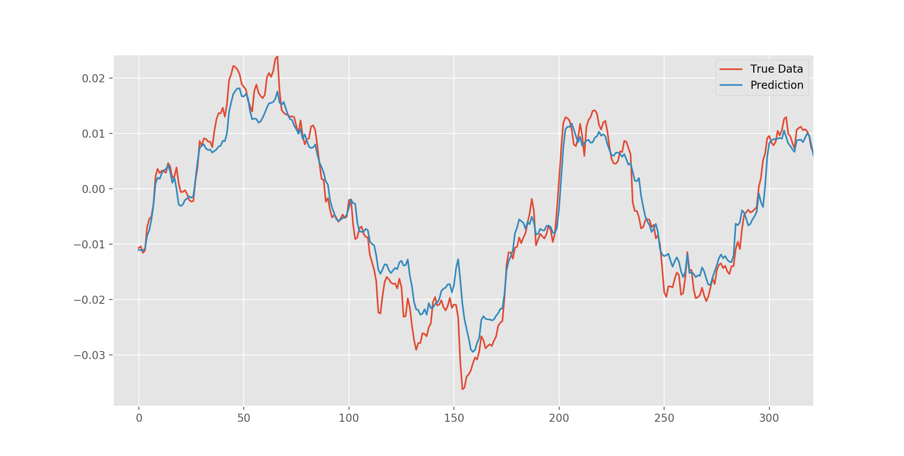
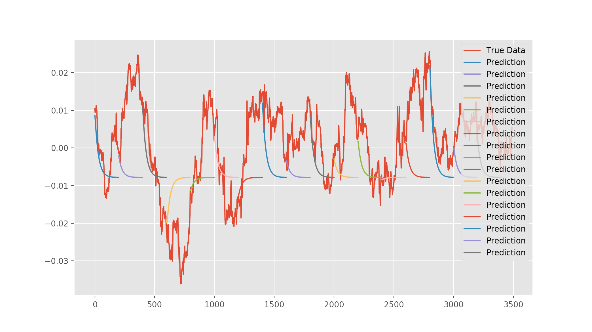

# LSTM Predicting Forex Currency Pairs

This goal of this repo is use TensorFlow interfaced via Keras to train an LSTM Neural Network to predict the behavior of eight of the most traded currencies globally.

LSTM is a better option (over traditional RNNs) for such complex time-series analysis because it updates it's module state and allows neurons to keep long-term memory of data.

*Results when predicting a single point with the entire history behind it. This won't be much help to determine when to open or close a forex position, but can be applied to volatility forecasting.*

*Results of predicting entire sequences of data, the length of the sequence is determined in the config file. These predictions can be useful to place orders*

__future development__:
  - backtest
  - contrast model accuracy when combing all currency pairs into one network vs training different networks per market
  - grid search hyperparameters
